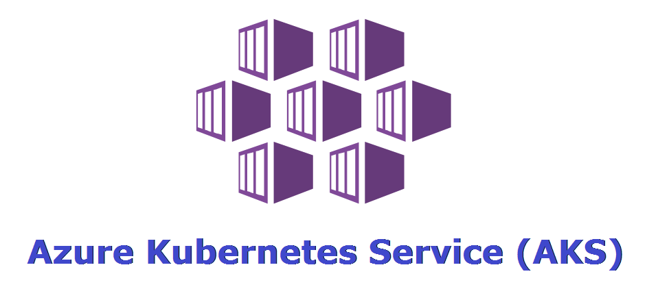

# Kubernetes on Azure (AKS) - Practice Labs

## Introduction

Welcome to the Azure Kubernetes Service (AKS) practice labs! This repository contains hands-on exercises to help you learn and master various aspects of deploying and managing Kubernetes clusters on Azure. Feel free to explore the different topics listed below:

## Content

### 1. [Basic LoadBalancer](LAB01/Dockerfile_Build_And_Push_to_ACR.md)

   Build a custom Docker image from a simple Node.js application and push it to Azure Container Registry (ACR).

### 2. [Standard LoadBalancer](LAB02/Standard_Loadbalancer.md)

   Dive deeper into LoadBalancer concepts, focusing on the standard configuration and its benefits for your AKS deployment.

### 3. [Traffic from Internet](LAB03/Traffic_from_internet.md)

   Learn how to manage and route traffic from the internet to your AKS cluster, ensuring seamless connectivity for your applications.

### 4. [External Nginx Ingress Controller + Cert Manager](LAB04/External_Nginx_Ingress_Controller_Cert_Manager.md)

   Implement an external Nginx Ingress Controller along with Cert Manager to manage SSL/TLS certificates, enhancing the security of your AKS applications.

### 5. [External Application Gateway Ingress Controller](LAB05/External_ApplicationGateway_Ingress_Controller.md)

   Explore the integration of the Azure Application Gateway Ingress Controller to efficiently manage ingress traffic in your AKS cluster.

### 6. [Create AKS using CLI](LAB06/Create_AKS_using_CLI.md)

   Master the creation of AKS clusters using the Azure Command-Line Interface (CLI), providing a hands-on experience in deploying Kubernetes on Azure.

### 7. [AKS Authorization](LAB07/AKS_Authorization.md)

   Understand and implement role-based access control (RBAC) in AKS, ensuring secure access and permissions for users and applications.

### 8. [AKS + Azure AD](LAB08/AKS_Azure_AD.md)

   Integrate AKS with Azure Active Directory (AD), enabling seamless authentication and authorization for your Kubernetes workloads.

### 9. [Users in AKS](LAB09/Users_in_AKS.md)

   Explore user management within AKS, including creating and managing user accounts, providing a comprehensive understanding of identity and access management.

### 10. [Dynamic Volumes](LAB10/Dynamic_volumes.md)

   Dive into the dynamic provisioning of volumes in AKS, understanding how to efficiently manage storage for your containerized applications.

## Prerequisites

- **Azure Account**: Ensure you have an active Azure account. If you don't have one, you can [create a free account](https://azure.microsoft.com/free/) before proceeding.

- **Azure CLI**: Install the [Azure CLI](https://docs.microsoft.com/en-us/cli/azure/install-azure-cli) on your local machine to interact with Azure services from the command line.

- **kubectl**: Install [kubectl](https://kubernetes.io/docs/tasks/tools/install-kubectl/) on your machine to manage Kubernetes clusters.

- **Git**: Install [Git](https://git-scm.com/book/en/v2/Getting-Started-Installing-Git) to clone this repository and access the practice labs.

## License

This project is licensed under the [MIT License](https://opensource.org/licenses/MIT).

## Contribution

Feel free to clone this repository and work through the exercises at your own pace. Each directory contains a detailed README.md file with instructions to guide you through the lab. Happy learning and happy Kuberneting on Azure! 🚀
